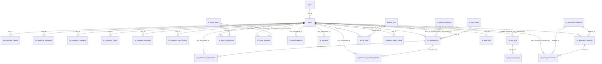

# DATABASE_RELATIONSHIP_DIAGRAM.md

```mermaid
erDiagram
  roles ||--o{ users : "role_id"
  users ||--o{ cross_domain_tokens : "user_id"

  users ||--o{ hr_employee_schedules : "user_id"
  users ||--o{ hr_emergency_contacts : "user_id"
  users ||--o{ hr_employee_family : "user_id"
  users ||--o{ hr_employee_education : "user_id"
  users ||--o{ hr_employee_work_history : "user_id"

  users ||--o{ hr_attendances : "user_id"
  hr_work_shifts ||--o{ hr_attendances : "shift_id"
  hr_checkin_locations ||--o{ hr_attendances : "check_in_location_id/check_out_location_id"
  users ||--o{ hr_attendances : "adjusted_by/approved_by"

  hr_attendances ||--o{ hr_attendance_adjustments : "attendance_id"
  users ||--o{ hr_attendance_adjustments : "user_id/reviewed_by"
  hr_attendances ||--o{ hr_attendance_outside_requests : "attendance_id"
  users ||--o{ hr_attendance_outside_requests : "user_id/reviewed_by"

  hr_leave_types ||--o{ hr_leave_entitlements : "leave_type_id"
  users ||--o{ hr_leave_entitlements : "user_id"
  hr_leave_types ||--o{ hr_leave_requests : "leave_type_id"
  users ||--o{ hr_leave_requests : "user_id/approver_*/final_approved_by/cancelled_by"
  users ||--o{ hr_dayoff_requests : "user_id/reviewed_by"
  users ||--o{ ot_requests : "user_id/approved_by"

  hr_document_templates ||--o{ hr_document_requests : "template_id"
  users ||--o{ hr_document_requests : "user_id/assigned_to/processed_by"
  hr_document_requests ||--o{ hr_issued_documents : "request_id"
  hr_document_templates ||--o{ hr_issued_documents : "template_id"
  users ||--o{ hr_issued_documents : "user_id/issued_by/revoked_by"

  payroll_runs ||--o{ payroll_slips : "payroll_run_id"
  users ||--o{ payroll_slips : "user_id"
  users ||--o{ employee_salary_setup : "user_id"

  users ||--o{ hr_api_keys : "created_by/service_user_id/revoked_by"
  hr_api_keys ||--o{ hr_api_request_logs : "api_key_id"
  users ||--o{ hr_audit_logs : "user_id"
```

