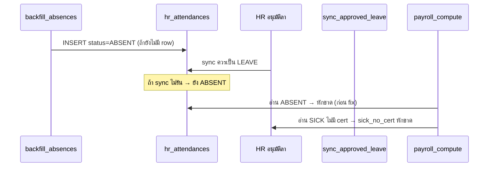

# Full Audit: ทำไมสลิปเงินเดือนมี "ขาดงาน" (Absence Deduction)

**วันที่:** 2026-05-25  
**กรณีอ้างอิง:** [payroll_print.php?slip_id=251](https://crm.tp-asset.com/payroll_print.php?slip_id=251)  
**เคสที่พบใน HR Summary:** วิจิตรา เสนคะ (TPE01004) — ลาป่วย 22 พ.ค. 2569 แต่ยังแสดงขาดงาน

---

## 1. สรุปผู้บริหาร (Executive Summary)

ระบบ TP มี **2 ความหมายของ "ขาดงาน"** ที่ไม่เหมือนกัน:

| มุมมอง | ระบบ | ความหมาย |
|--------|------|----------|
| **HR สรุปพนักงาน** | tp-hr `EmployeeSummaryService` | นับจาก `hr_attendances.status = ABSENT` หรือไม่มี record |
| **เงินเดือน (สลิป)** | tp-crm `payroll_compute_attendance_deductions()` | นับ **6 กฎหัก** รวมถึง **ลาป่วยไม่มีใบรับรองแพทย์ → ตีเป็นขาด** |

ดังนั้น **พนักงานอาจมีใบลาป่วยอนุมัติแล้ว แต่สลิปยังหักขาดงานได้** — ถ้าเป็นไปตามนโยยบายข้อ 2 (ไม่มีใบรับรองแพทย์) หรือมี record `ABSENT` ที่ไม่ sync กับใบลา

---

## 2. สถาปัตยกรรม (System Map)

```
tp-checkin          → เขียน hr_attendances (check-in/out)
tp-hr               → อนุมัติลา, backfill ABSENT, EmployeeSummary
tp-crm payroll      → คำนวณสลิป → payroll_slips (absence_deduction, attendance_detail_json)
                      แสดง payroll_print.php
```

**แหล่งข้อมูลร่วม (MySQL `tp_crm`):**

- `hr_attendances` — สถานะรายวัน (PRESENT, LATE, ABSENT, LEAVE, WFH, …)
- `hr_leave_requests` + `hr_leave_types` — ใบลา + ประเภท (SICK, …)
- `payroll_slips` — ผลคำนวณที่ freeze ตอน calculate/approve รอบเงินเดือน
- `system_settings` — อัตราหัก (`payroll_absent_rate` default 600 บาท/วัน)

**Engine คำนวณเงินเดือน (สำคัญ):**

- Production CRM ใช้ **`modules/payroll/queries.php`** → `payroll_compute_attendance_deductions()` (local)
- tp-hr มี **`PayrollService::computeAttendanceDeductions()`** (canonical ตาม Phase 6.1)
- Flag `USE_TPHR_PAYROLL=1` ใน `system_settings` ยังไม่ได้เปิดใช้ทั่วทั้ง CRM → **logic สองชุดต้อง sync**

---

## 3. กฎการหักขาดงานบนสลิป (6 Rules)

อ้างอิง `tp-crm/modules/payroll/queries.php` และ `tp-hr/core/Services/PayrollService.php`:

| # | เงื่อนไข | kind ใน breakdown | หัก (default) |
|---|----------|---------------------|---------------|
| 1 | `hr_attendances.status = ABSENT` | `absent` | 600/วัน |
| 2 | **ลาป่วย (SICK) อนุมัติ แต่ไม่มีใบรับรองแพทย์** | `sick_no_cert` | 600 × จำนวนวันลา |
| 3 | มาสาย 1–30 นาที | `late_30` | 150/ครั้ง |
| 4 | มาสาย 31–60 นาที | `late_60` | 300/ครั้ง |
| 5 | มาสาย > 60 นาที (`payroll_late_over60_as_absent=1`) | `late_over60_absent` | 600/วัน |
| 6 | วันทำงานไม่มี record เลย | `missing_attendance_absent` | 600/วัน |

**ไม่หัก:** วันหยุดนักขัตฤกษ์, วันหยุดประจำสัปดาห์, วันที่มีใบลา (pending/approved), WFH auto-stamp, `late_excused=1`

---

## 4. Root Cause Analysis — เคส slip_id=251 / TPE01004

### 4.1 สาเหตุที่เป็นไปได้ (เรียงตามความน่าจะเป็น)

#### A) ลาป่วยไม่มีใบรับรองแพทย์ (นโยบาย — ไม่ใช่ bug)

- กฎข้อ 2: แม้ HR อนุมัติลาป่วยแล้ว ถ้า `document_path IS NULL` → payroll **ยังหักเป็นขาด**
- บนสลิปจะแสดง note: `ลาป่วยไม่มีใบรับรองแพทย์ (N วัน)`
- **วิธีแก้ข้อมูล:** อัปโหลดใบรับรองที่ CRM/HR → recalculate สลิป

#### B) Record ABSENT ค้าง + ใบลาอนุมัติทับซ้อน (bug — แก้แล้ว 2026-05-25)

- Cron `backfill_absences.php` สร้าง `ABSENT` ก่อน HR อนุมัติลา
- `crm_line_sync_approved_leave_attendance()` ควรเปลี่ยนเป็น `LEAVE` แต่อาจล้มเหลว / รันไม่ครบ
- **ผล:** HR Summary แสดงทั้ง "ขาดงาน" และ "ลาป่วยอนุมัติ" วันเดียวกัน (เช่น 22 พ.ค.)
- **Fix tp-hr:** `EmployeeSummaryService` reconcile + ไม่นับขาดเมื่อมีลาอนุมัติ (`1349e3d`)
- **Fix tp-crm payroll:** sync skip ABSENT เมื่อมีลาอนุมัติ (commit วันเดียวกัน)

#### C) วันขาดจริง (เช่น 14 พ.ค.)

- ไม่มีใบลา / ไม่มี check-in → `ABSENT` ถูกต้อง
- หัก 600 บาท/วันตามกฎข้อ 1

#### D) สลิป freeze ค่าเก่า

- `payroll_slips` เก็บผลตอน calculate รอบนั้น
- แก้ attendance/ใบลาหลัง approve แล้ว **ต้อง recalculate** ถึงจะเปลี่ยนสลิป

### 4.2 วิธีตรวจ slip_id=251 บน production

```bash
# บน server (path tp-hr)
php scripts/audit_payroll_slip_absence.php --slip-id=251
```

Script จะแสดง:

- พนักงาน / เดือน / ค่า `absent_days`, `absence_deduction` ใน DB
- Breakdown สดจาก `PayrollService` (tp-hr)
- รายการ `hr_attendances` + ใบลาอนุมัติ + conflict ABSENT∩LEAVE

**ดู breakdown ในสลิป:** คอลัมน์ `payroll_slips.attendance_detail_json` → `breakdown[].kind` + `note`

---

## 5. Cross-System Integration Gaps (พบจาก Audit)

| ช่องว่าง | ผลกระทบ | สถานะ |
|---------|---------|--------|
| CRM payroll ไม่ skip ABSENT เมื่อมีลาอนุมัติ | หักซ้ำ / ขัดกับ HR Summary | **แก้ queries.php** |
| CRM ไม่มี `findMissingAbsentDates` | วันไม่มี record อาจไม่หัก (under-deduct) | **เพิ่มแล้ว** |
| tp-hr fix แต่ CRM ยังใช้ local engine | สลิป CRM ไม่ได้รับ fix จนกว่า sync CRM | **แก้แล้ว** |
| `USE_TPHR_PAYROLL=0` | Logic ซ้ำ 2 repo เสี่ยง drift | แนะนำเปิด API mode ระยะกลาง |
| ลาป่วยไม่มีใบรับรอง = ขาด (payroll) แต่ HR Summary นับเป็น "ลา" | สับสนผู้ใช้ | ต้องสื่อสาร + แสดง sick_no_cert ใน HR UI |
| backfill_absences ไม่ overwrite row ที่มีอยู่ | ABSENT ค้างหลังอนุมัติลา | reconcile ตอนอ่าน summary + sync ตอน approve |

---

## 6. Data Flow — วันลาป่วย 22 พ.ค. (เคส TPE01004)



**หลัง fix (2026-05-25):**

- Summary: นับเป็นลา ไม่ใช่ขาด (ถ้ามีใบลาอนุมัติ)
- Payroll CRM: ข้าม ABSENT ถ้ามีลาอนุมัติ — **แต่ยังหัก sick_no_cert ถ้าไม่มีใบรับรอง**

---

## 7. วิธีแก้ไข / ปรับข้อมูล (Runbook)

### 7.1 ถ้าขาดเพราะลาป่วยไม่มีใบรับรอง

1. เปิดใบลาที่ CRM/HR → อัปโหลดใบรับรองแพทย์ (`document_path`)
2. Payroll → รอบที่เกี่ยวข้อง → **Recalculate** พนักงานคนนั้น
3. ตรวจ `attendance_detail_json` ว่าไม่มี `sick_no_cert` แล้ว

### 7.2 ถ้าขาดเพราะ ABSENT ค้าง + มีใบลาอนุมัติ

1. Deploy fix ล่าสุด (tp-hr + tp-crm)
2. เปิด HR Summary ครั้งหนึ่ง (auto-reconcile ABSENT→LEAVE)  
   หรือรัน approve sync ซ้ำ / manual UPDATE status=LEAVE
3. Recalculate สลิปใน CRM

### 7.3 ถ้าขาดจริง (ไม่มีลา ไม่มีเวลา)

1. ยืนยันที่ `/hr/attendance.php` วันนั้น
2. ถ้าพนักงานมีเหตุผล → แก้สถานะเป็น LEAVE/PRESENT ผ่าน HR
3. Recalculate สลิป

### 7.4 Recalculate สลิป (CRM)

- รอบ status `draft` / `calculated`: แก้ salary setup หรือ attendance แล้วระบบ recalc auto บาง flow
- รอบ `approved`: ต้องยกเลิกอนุมัติ / recalculate manual ตาม process องค์กร

---

## 8. Checklist Regression

- [ ] `audit_payroll_slip_absence.php --slip-id=251` บน production
- [ ] ตรวจ `attendance_detail_json` ของ slip 251 — แต่ละ `kind`
- [ ] TPE01004 เดือน 2026-05: วัน 14 และ 22 ใน HR Summary ตรงกับ payroll
- [ ] ลาป่วยมีใบรับรอง → ไม่มี `sick_no_cert` ใน breakdown
- [ ] Recalculate แล้ว `absence_deduction` ตรง breakdown
- [ ] เปรียบเทียบ tp-hr vs CRM `computeAttendanceDeductions` ให้ผลเท่ากัน

---

## 9. แนะนำ Phase ถัดไป

1. **เปิด `USE_TPHR_PAYROLL=1`** — engine เดียว ลด drift
2. **แสดง sick_no_cert ใน HR Summary** — แยก "ลา (ไม่หัก)" vs "ลาป่วยไม่มีใบรับรอง (หักเงินเดือน)"
3. **Recalculate batch** รอบพฤษภาคม 2569 หลัง deploy fix
4. **Monitor** conflict ABSENT+LEAVE ด้วย cron รายวัน reconcile

---

## 10. ไฟล์อ้างอิง

| ไฟล์ | บทบาท |
|------|--------|
| `tp-crm/modules/payroll/queries.php` | `payroll_compute_attendance_deductions()` |
| `tp-crm/payroll_print.php` | แสดงสลิป + absence/lateness rows |
| `tp-hr/core/Services/PayrollService.php` | Canonical engine |
| `tp-hr/core/Services/EmployeeSummaryService.php` | HR dashboard summary |
| `tp-hr/cron/backfill_absences.php` | สร้าง ABSENT ย้อนหลัง |
| `tp-hr/core/CrmLineNotifierBridge.php` | `crm_line_sync_approved_leave_attendance()` |
| `tp-hr/scripts/audit_payroll_slip_absence.php` | CLI diagnostic |
